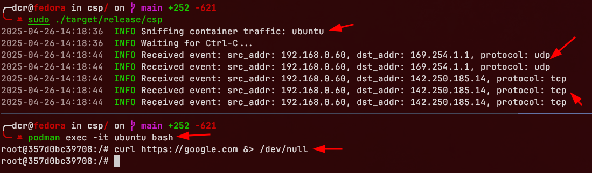

# csp (Container Snoop) 🐝

_A Lightweight eBPF Tool to Monitor Podman Traffic via cgroup Hooks_

> This demo could easily be extended to sniff traffic from container runtimes like containerd or others.

# Introduction

After installing `podman` in your computer, run:

```shell
systemctl --user enable --now podman.socket
ls -l /run/user/$(id -u)/podman/podman.sock
```

> `I personally use Fedora 42, with kernel version 6.14.3-300.fc42.x86_64.`

Install rust:

```shell
curl --proto '=https' --tlsv1.2 -sSf https://sh.rustup.rs | sh
rustup install stable && rustup toolchain install nightly --component rust-src
rustup default nightly
cargo install bpf-linker
```

# Usage

```shell
cargo run --release --config 'target."cfg(all())".runner="sudo -E"' --
# Or compile the binary
cargo build --release
sudo ./target/release/csp
```

# Demo



```shell
podman run --rm -itd --name ubuntu docker.io/ubuntu:latest
podman exec -it ubuntu bash
root@357d0bc39708:/# curl https://google.com &> /dev/null
```